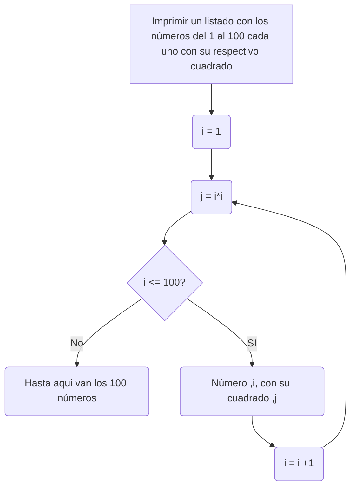
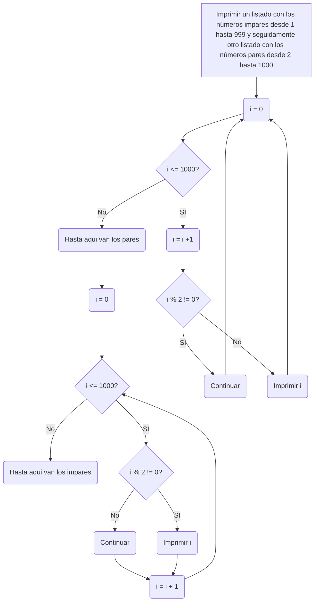
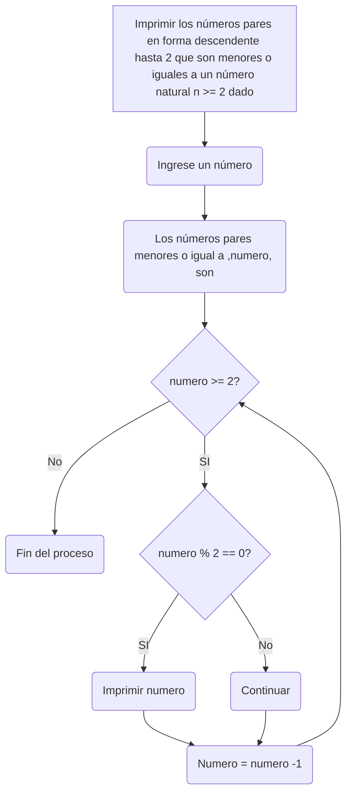

# BUCLES Y EL USO DEL WHILE

### PUNTO 1

#### Imprimir un listado con los números del 1 al 100 cada uno con su respectivo cuadrado.

Para este punto lo que hice fue definir la variable i = 1, como entero, y otra variable, j (entero), que sera igual a i*i, siendo j el cuadrado del número de la variable i. Posterior a eso, establecí un ciclo while, en el que mientras i sea menor o igual a 100 me imprima: "Número: " +str(i)+ " con su cuadrado: " +str(j), para luego sumarle 1 a i, asi sucesivamente hasta que i sea igual a 100.

```
i : int = 1
j : int = i*i
while i <= 100:
  print("Número: " +str(i)+ " con su cuadrado: " +str(j))
  i = i +1
  j = i*i
print("Hasta aqui van los 100 números")
```
#### Diagrama de Flujo



### PUNTO 2

#### Imprimir un listado con los números impares desde 1 hasta 999 y seguidamente otro listado con los números pares desde 2 hasta 1000

Para este punto establecí una variable i = 0 como entero, y un codigo while en el que mientras i sea menor o igual a mil, le sume uno a i, y luego establezca un condicional en el que si el número de divido 2 de un residuo diferente de 0, continue, y en caso de no cumplir el condicional, me imprima el numero i (los pares).

Al terminar de imprimir los números pares, se imprime un texto que dice "Hasta aqui van los pares"

Posterior a eso volvi a redefinir la variables i, como 0 para reiniciar su valor, volvi a establecer un codigo while igual al anterior pero que esta vez me establezca un codigo if en el que si el numero divido dos da reciduo difernete de 0, me imprima el número, posteriormente le sume uno a i y asi sucesivamente hasta que salga del ciclo.

Al terminar de imprimir los números imares, se imprime un texto que dice "Hasta aqui van los impares"

```
i : int = 0
while i <= 1000:
    i = i + 1
    if i % 2 !=0:
      continue
    print(i)

print("Hasta aqui van los pares")

i = 0
while i <= 1000:
  if i % 2 != 0:
    print(i)
  i = i + 1

print("Hasta aqui van los impares")
```

#### Diagrama de flujo



### PUNTO 3

#### Imprimir los números pares en forma descendente hasta 2 que son menores o iguales a un número natural n ≥ 2 dado

Para este punto inicie pidiendole al usuario que ingrese un número al azar, que el desee. Luego que imprima "Los números pares menores o igual a " +str(numero)+ " son :". Posteriormente estableci un codigo un while en el que mientras el número sea mayor o igual a 2, establezca un condicional if en el que si el residuo del número al dividirlo entre 2 es 0 lo imprima, y si no es igual no lo imprima, luego a eso le reste uno al número dado por el usuario y asi hasta que no se cumpla el ciclo

```
numero = int(input("Ingrese un entero: "))
print("Los números pares menores o igual a " +str(numero)+ " son :" )
while numero >= 2:
  if numero % 2 == 0:
    print(numero)
  numero = numero - 1
```
#### Diagrama de flujo



### PUNTO 4

#### En 2022 el país A tendrá una población de 25 millones de habitantes y el país B de 18.9 millones. Las tasas de crecimiento anual de la población serán de 2% y 3% respectivamente. Desarrollar un algoritmo para informar en que año la población del país B superará a la de A.

En los primeros pasos defini las variables de los dos paices, y del año actual, con los valores que nos dio el punto. Estableci un codigo while en el que minetras el pais A tenga mayor poblacion que el pais b: Sume uno al año, aumente en 2 porciento la poblacion del país A y en 3 porciento la población del país B. Cuando no se cumpla el ciclo, imprima en que año supero el pais b al pais a y cual es la población de ambos ese año.
```
pais_A : int = 25000000
pais_B : int = 18900000
año_actual : int = 2022
while pais_A > pais_B:
  año_actual += 1
  pais_A = pais_A + pais_A*0.02
  pais_B = pais_B + pais_B*0.03
print("En el año " +str(año_actual)+ " la población del país B con un número de habitantes en ese año de " +str(pais_B)+ " millones de habitantes, supero al país A con ahora" +str(pais_A)+ " millones de habitantes")
```

### PUNTO 5

#### Imprimir el factorial de un número natural n dado.

Defini una variable que solicite un número al usuario, un numero_n como uno  y factorial como uno (todos enteros). Posteriormente estableci un codigo while en el que minetras el numero_n sea menor o igual al numero que ingreso el usuario, y que el número ingresado por el usuario sea mayor que 0: factorial = factorial * numero_n, luego se le suma uno al numero_ n. 

Luego de que no se cumpla el ciclo que me imprima la variabla factorial, que sera pese a la redundancia, el factorial del número ingresado por el usuario.
```
numero_factorial = int(input("Ingrese un entero: "))
numero_n : int = 1
factorial : int = 1
while numero_n <= numero_factorial and numero_factorial>0:
  factorial = factorial*numero_n
  numero_n += 1
print("El factorial de " +str(numero_factorial)+ " es " +str(factorial))
```

### PUNTO 6

#### Implementar un algoritmo que permita adivinar un número dado de 1 a 100, preguntando en cada caso si el número es mayor, menor o igual.

Estableci un condigo en el que importe la libreria random, le pida al usuario que ingrese un número entre uno y cien, definir una bandera como true, y dos variables minimo (entera igual a uno) y maximo (entera igual a 100)

Establezca un codigo while en el que mientras la bandera sea verdadera:

Cree una variables de un numero aleatorio, en un rango entre las variables minimo y maximo.

En base a eso se le pregunta al usuario si el número aleatorio es mayor menor o igual al que el habia puesto inicialmente.

Si pone mayor el minimo sera igual al numero aleatorio + 1, ya que no puede ser menor.

Si pone menor, el minimo sera igual al numero aleatorio - 1, ya que no puede er mayor.

Estos dos permitiran ajustar los rangos mientras el ciclo busca que el número aleatorio sea igual al ingresado por el usuario.

Y si es igual, estbalecemos la variable break que rompa el ciclo, y nos diga que el numero en que pensaba, era el que el numero aletario nos dio

```
import random
numero_ = int(input("Ingresa un entero entre uno y cien: "))
bandera : bool = True
minimo : int = 1
maximo : int = 100
while bandera == True:
  numero_secreto = random.randint(minimo, maximo)
  pregunta_ = input("Tu número es mayor, menor o igual a " +str(numero_secreto)+ ": ")
  if pregunta_ == "mayor":
    minimo = numero_secreto + 1
  elif pregunta_== "menor" :
    maximo = numero_secreto -1
  elif pregunta_ == "igual":
    break
print("El número en el que pensabas es: " +str(numero_secreto))
```

### PUNTO 7

#### Implementar un programa que ingrese un número de 2 a 50 y muestre sus divisores

Establecer un codigo que le pida al usuario un número_ entre 2 y 50
y uno un numero como entero = 2

Primero si el numero esta entre 2 y 50 imprima "los divisores del numero_ son:". 

Dentro de este if, un ciclo while en el que mientras numero sea menor o igual a numero_  en el que si al dividir numero_ entre numero su residuo es 0 imprima el numero, y en caso tal de que no, no lo imprima, posterior a eso le sume uno al numero y continue en el ciclo.

Si no cumple el primer if, imprima "Perro es entre 2 y 50 loca"
```
numero_ = int (input("Ingrese un número entre 2 y 50 : "))
numero : int = 1
if 2 <= numero_ <= 50:
  print("Los divisores de " +str(numero_)+ " son:")
  while numero <= numero_:
    if numero_ % numero == 0:
      print(numero)
    numero= numero + 1
else:
  print("Perro es entre 2 y 50 loca")
```

### PUNTO 8

#### Implementar el algoritmo que muestre los números primos del 1 al 100. Nota: use funciones

Utilice las funciones para definir tres variables (numero, contador_, num_ (como flotantes)

Dentro de la función establecí un ciclo while en el que mientras numero sea menor a 100:
  numero = numero + 1
  num_ 1
  contador_ = 0
  
  Otro ciclo while en el que mientras num_ sea menor a la raiz del numero:
    Establezca un condifo iff en que si el residuo de numero/num_ es 0 le sume uno al contador
    num_ = num_ +1

  Fuera del segundo ciclo establezca que si el contador_ fue igual a uno imprima el numero (esto quiere decir que no pudo ser dividio por ningun número diferente de el y uno, por tanto es primo)

Establezca todas estas condiciones hasta acabar el ciclo.

Luego llamamos a la función para que nos imprima la función, obteniendo todos los número primos de 1 a 100

```
def numero_primo(numero: float, num_ : float, contador_ : float) -> float:
  while numero < 100 :
    numero = numero + 1
    num_ = 1
    contador_ = 0
    while  num_ <= (numero **0.5):
        if numero % num_ == 0:
          contador_ = contador_ + 1
        num_ = num_ + 1
    if contador_ == 1:
      print(numero)
  return "Estos fueron los primos"

if __name__ == "__main__":
  numero : float = 1
  num_ : float = 1
  contador_: float = 0
  num_primo = numero_primo(numero, num_ , contador_)
  print(num_primo)
```
